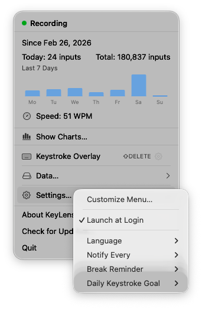
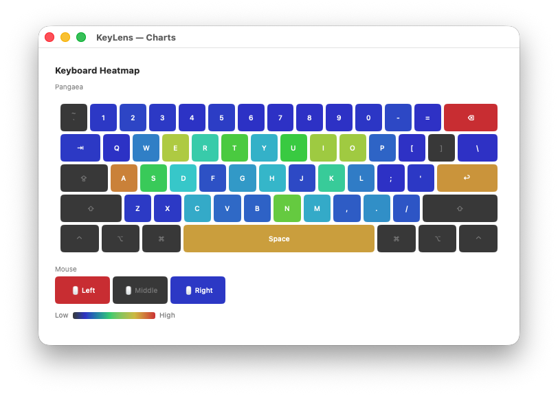

# KeyLens

English | [日本語](docs/README.ja.md)

<div align="center">

[](https://etalli.github.io/262_KeyLens/landing-page/index.html)
[](https://github.com/etalli/262_KeyLens/releases/latest)


[](https://github.com/etalli/262_KeyLens/releases/latest)
[](LICENSE)
[](https://hypercommit.com/262-keylens)

KeyLens is a macOS menu bar app that tracks your keystrokes locally and recommends ergonomic layout changes based on your actual usage.

The stored data is key names and counts only — your actual typed content cannot be reconstructed from it.


[**Official Page**](https://etalli.github.io/262_KeyLens/landing-page/) — screenshots and layout optimization walkthrough

<table>
  <tr>
    <td></td>
    <td align="center"><i>Menu Bar</i></td>
    <td></td>
    <td align="center"><i>Heatmap</i></td>
  </tr>
</table>

<video src="https://github.com/etalli/262_KeyLens/raw/main/docs/images/KeyLens-Speedometer.mp4" controls width="600"></video>

</div>

---

## Features

- **Global recording** — Counts keystrokes in any app, no exceptions
- **Menu bar statistics** — Today's count, all-time total, average keystroke interval; toggle and reorder these widgets as you like
- **Charts** — Keyboard heatmap, top keys, bigrams, apps, devices, daily totals, ergonomic learning curve, weekly delta report, and more
- **Weekly Summary Card** — Generates a PNG of your weekly stats every Saturday; also available any time from the Data menu
- **Keystroke Overlay** — Floating window showing recent keystrokes in real time (⌘C / ⇧A style)

---

## Quick Install

1. Download **[KeyLens.dmg](https://github.com/etalli/262_KeyLens/releases/latest)** (or the ZIP from the release page)
2. Open the DMG and drag **KeyLens.app** to `/Applications`
3. **Important (Security):** On first launch, macOS will block the app as it is from an "unidentified developer". Run this in Terminal:

   ```bash
   sudo xattr -rd com.apple.quarantine /Applications/KeyLens.app
   ```

   Then launch normally from Finder or Spotlight.
4. An alert will ask for **Accessibility** permission.
   - Click **Open System Settings** → **Privacy & Security > Accessibility** → enable **KeyLens**.
5. Switch to any app — the keyboard icon appears in your menu bar and monitoring starts.

> **Note:** The app uses an ad-hoc signature. This manual override is required only once.

---

## How to Use

### Menu bar

Click the keyboard icon (⌨) in the menu bar to open the panel.

| Item | Description |
|------|-------------|
| **Today / Total** | Keystroke count for today and all time |
| **Avg interval** | Running average time between keystrokes (ms) |
| **Top keys** | Most-pressed keys with counts |
| **Top app today** | Frontmost application with the most keystrokes today |
| **Show All** | Opens a ranked table of every key and mouse button |
| **Charts** | Opens the full analytics window |
| **Overlay** | Toggles the real-time keystroke overlay (also: global hotkey ⌃⌥O, configurable) |
| **Settings…** | Customize menu display, language, notifications, reset, export CSV, export weekly summary card (PNG), export Year in Review card (PNG), backup/restore data, open log folder |

### Charts window

Open via **Charts** in the menu. Sections (scroll down):

#### Ergonomics tab
| Section | What it shows |
|---------|---------------|
| **Keyboard Heatmap** | Key layout colored by frequency or strain; supports ANSI / Ortho / JIS / Custom (KLE import) |
| **Top 20 Keys** | Most-pressed keys by type |
| **Top 20 Bigrams** | Most frequent key pairs with hand alternation stats |
| **Ergonomic Learning Curve** | Same-finger and high-strain rates over time |
| **Today's Fatigue Curve** | Hourly WPM and ergonomic rates for today |
| **Weekly Delta Report** | Last 7 days vs prior 7 days with trend arrows |
| **Key Categories** | Key-type distribution chart |
| **Keyboard Shortcuts** | Top modifier+key combinations |
| **Apps** | Keystroke counts and ergonomic scores per application |
| **Devices** | Keystroke counts and ergonomic scores per device |

#### Activity tab
| Section | What it shows |
|---------|---------------|
| **Live IKI** | Recent inter-keystroke intervals, updated live |
| **IKI Distribution** | Histogram of your typing rhythm |
| **Daily Totals** | Per-day keystroke counts |
| **Typing Speed** | Daily average WPM over time |
| **Backspace Rate** | Daily correction rate over time |
| **Hourly Distribution** | Keystroke count by hour of day |
| **Monthly Totals** | Keystroke count per calendar month |
| **Weekly Activity Heatmap** | Keystroke density by day of week and hour |

#### Summary tab
| Section | What it shows |
|---------|---------------|
| **Activity Calendar** | GitHub-style heatmap of daily keystroke activity |
| **Weekly Report** | Last 7 days vs prior 7 days with trend arrows |
| **Typing Profile** | Inferred typing style and fatigue risk level |
| **Mouse vs Keyboard Balance** | Daily ratio of mouse vs keyboard usage |

#### Training tab
| Section | What it shows |
|---------|---------------|
| **Practice Drills** | Typing drills based on your slowest bigrams and trigrams |
| **Training History** | Past drill results with accuracy and WPM |
| **Training Targets** | Top bigrams ranked by training priority |
| **Trigram Training Targets** | Top 3-key sequences ranked by latency |

#### Compare tab
| Section | What it shows |
|---------|---------------|
| **Period Comparison** | Side-by-side stats for two custom date ranges |

#### Mouse tab
| Section | What it shows |
|---------|---------------|
| **Daily Distance** | Mouse travel distance per day |
| **Hourly Distribution** | Mouse activity by hour of day |
| **Direction Breakdown** | Proportion of movement in each direction |
| **Daily Direction Table** | Per-day directional mouse movement |
| **Mouse Click Count** | Left, middle, and right button click counts |

### AI Analysis

Export your keystroke data (Settings… > Data > Export CSV) and paste it into an AI tool (Claude, ChatGPT, etc.) along with the built-in prompt (Settings… > Data > Edit AI Prompt) for layout optimization advice.

---

### Keystroke Overlay

<table>
  <tr>
    <td></td>
    <td></td>
  </tr>
  <tr>
    <td align="center">Setting</td>
    <td align="center">Example</td>
  </tr>
</table>
</div>

Toggle via **Overlay** in the menu, or press **⌃⌥O** from anywhere. It shows recent keystrokes in a floating window that fades after 3 seconds. Position, size, and hotkey are all configurable via ⚙.

---

## Security

| | Details |
|---|---|
| **Records** | Key names (e.g. `Space`, `e`) and mouse button names with press counts only |
| **Does NOT record** | Typed text, sequences, passwords, clipboard content, or cursor position |
| **Storage** | Local JSON file only — no network transmission |
| **Event access** | `.listenOnly` tap — read-only, cannot inject or modify keystrokes |

<details>
<summary>Full risk summary</summary>

| Area | Risk | Mitigation |
|------|------|------------|
| Global key monitoring | High (by nature) | `.listenOnly` + `tailAppendEventTap` — passive only |
| Data content | Low | Key name + count only; typed text cannot be reconstructed |
| Data file | Medium | Unencrypted; readable by any process running as the same user |
| Network | None | No outbound connections |
| Code signing | Medium | Ad-hoc only; Gatekeeper blocks distribution to other users |

</details>

---

## Data file

```
~/Library/Application Support/KeyLens/counts.json
```

Use **Settings… > Open Log Folder** to open the directory in Finder. See [Architecture](docs/Architecture.md) for the schema.

---

## Build from Source

See [docs/HowToBuild.md](docs/HowToBuild.md) for prerequisites, build commands, test setup, and logs.

---

For internal design details, see [Architecture](docs/Architecture.md).
For the development roadmap, see [Roadmap](docs/Roadmap.md).
Bug reports and feature requests: open an [issue](https://github.com/etalli/262_KeyLens/issues).
