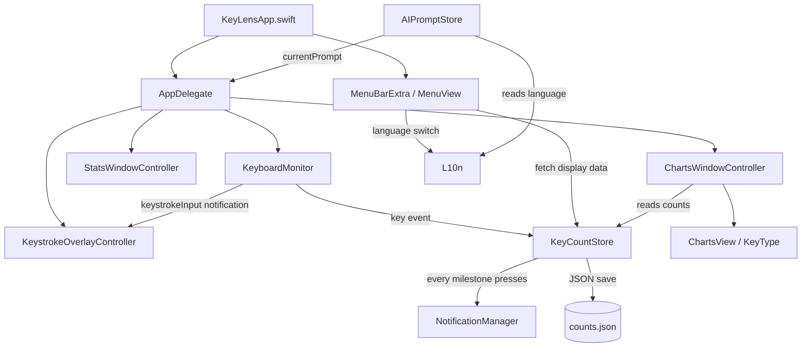

# Architecture

English

## Overview

KeyLens is built around three layers: event monitoring, data management, and UI control.



---

## File structure

```
262_KeyLens/
├── Package.swift
├── build.sh
├── Resources/
│   └── Info.plist
├── Sources/
│   ├── KeyLens/                          # App executable
│   │   ├── KeyLensApp.swift
│   │   ├── AppDelegate.swift
│   │   ├── AppDelegate+Actions.swift
│   │   ├── MenuView.swift
│   │   ├── KeyboardMonitor.swift
│   │   ├── KeyCountStore.swift
│   │   ├── KeyType.swift
│   │   ├── NotificationManager.swift
│   │   ├── StatsWindowController.swift
│   │   ├── ChartsWindowController.swift
│   │   ├── ChartsView.swift
│   │   ├── KeyboardHeatmapView.swift
│   │   ├── KeyboardDeviceInfo.swift
│   │   ├── KeystrokeOverlayController.swift
│   │   ├── OverlaySettingsController.swift
│   │   ├── AIPromptStore.swift
│   │   └── L10n.swift
│   └── KeyLensCore/                      # Research library (Phase 0+)
│       └── KeyboardLayout.swift
└── Tests/
    └── KeyLensTests/
        └── KeyboardLayoutTests.swift
```

---

## Data flow

```
Key press
  |
  v
CGEventTap  (OS-level event hook)
  |  KeyboardMonitor.swift
  |  inputTapCallback()  <-- file-scope global function (@convention(c) compatible)
  |
  +-- post Notification(.keystrokeInput)  --> KeystrokeOverlayController
  |
  v
KeyCountStore.shared.increment(key:)
  |  serial DispatchQueue for thread safety
  |  counts[key] += 1
  |  dailyCounts[today] += 1
  |  hourlyCounts[hour] += 1
  |  totalBigramCount += 1          <- if prev key mapped
  |  sameFingerCount += 1           <- if same finger & hand
  |  handAlternationCount += 1      <- if different hand
  |  bigramCounts["prev→key"] += 1  <- raw pair frequency (Issue #12)
  |  scheduleSave()   <- debounced 2 s write
  |
  +-- count % milestoneInterval == 0?
  |     YES -> DispatchQueue.main.async { NotificationManager.notify() }
  |
  v
(on menu open)
MenuBarExtra panel renders MenuView
  └─ KeyCountStore.{todayCount, totalCount, topKeys()}  -> display stats
```

---

## File responsibilities

### [KeyLensApp.swift](Sources/KeyLens/KeyLensApp.swift)

Entry point (marked with `@main`). Declares the app using SwiftUI's `App` protocol with a `MenuBarExtra` scene.

```swift
@main
struct KeyLensApp: App {
    @NSApplicationDelegateAdaptor(AppDelegate.self) var appDelegate

    var body: some Scene {
        MenuBarExtra {
            MenuView().environmentObject(appDelegate)
        } label: {
            Label("KeyLens", systemImage: "keyboard")
        }
        .menuBarExtraStyle(.window)
    }
}
```

`Info.plist` sets `LSUIElement = true` to suppress the Dock icon and the app-specific menu bar. `MenuBarExtra` provides the status bar icon and the popup panel. `@NSApplicationDelegateAdaptor` bridges to `AppDelegate` for lifecycle and monitor management.

---

### [AppDelegate.swift](Sources/KeyLens/AppDelegate.swift)

Manages the `KeyboardMonitor` lifecycle and Accessibility permission recovery. Conforms to `ObservableObject` so `MenuView` can react to state changes (e.g. `isMonitoring`, `copyConfirmed`).

**Permission recovery (layered):**
1. `appDidBecomeActive` — fires when the user switches back to any app; attempts `monitor.start()` immediately
2. `schedulePermissionRetry()` — polls `AXIsProcessTrusted()` every 3 s as a fallback
3. `setupHealthCheck()` — checks `monitor.isRunning` every 5 s and triggers retry if stopped

---

### [AppDelegate+Actions.swift](Sources/KeyLens/AppDelegate+Actions.swift)

Extension on `AppDelegate` containing all user-initiated actions triggered from `MenuView`: showing windows, toggling the overlay, exporting CSV, copying data to clipboard, editing the AI prompt, changing language, resetting counts, etc.

---

### [MenuView.swift](Sources/KeyLens/MenuView.swift)

SwiftUI view that renders the `MenuBarExtra` popup panel. Reads live data from `KeyCountStore.shared` on each render. Uses `@EnvironmentObject var appDelegate` to dispatch actions. Key subcomponents:

- **`OverlayRow`** — toggle + hover gear button + fixed-position checkmark in one row
- **`DataMenuRow`** — NSMenu popup for CSV export, AI prompt editing, open log folder
- **`SettingsMenuRow`** — NSMenu popup for Launch at Login, Language, Notify Every, Reset
- **`HoverRowStyle`** — shared `ButtonStyle` with hover highlight

---

### [KeyboardMonitor.swift](Sources/KeyLens/KeyboardMonitor.swift)

Intercepts system-wide key-down events via `CGEventTap`.

**Key design decision — `@convention(c)` constraint:**

`CGEventTapCallBack` is a C function pointer type, which means Swift closures that capture variables cannot be used directly. The callback is therefore defined as a file-scope global function and accesses state only through singletons (`KeyCountStore.shared`, etc.), which require no capture.

```
CGEvent.tapCreate(callback: inputTapCallback)
                            ^
                  global function (no captures)
                  -> implicitly convertible to @convention(c)
```

**Tap recovery:** If the tap is disabled by system timeout (`.tapDisabledByTimeout`), the callback immediately re-enables it via `CGEvent.tapEnable`.

Key code to name translation is handled by a static lookup table in `keyName(for:)` (US keyboard layout).

After translating a key name, the callback posts a `Notification(.keystrokeInput)` so `KeystrokeOverlayController` can display it without polling.

---

### [KeyCountStore.swift](Sources/KeyLens/KeyCountStore.swift)

Singleton that manages counts and persists them to disk.

**Thread safety:**

The `CGEventTap` callback runs outside the main thread. A serial `DispatchQueue` serialises all dictionary access.

```
CGEventTap thread             Main thread
      |                            |
  queue.sync { increment }    queue.sync { topKeys() }
      |  <-- serialised -->        |
  scheduleSave()                   ...
      |
  queue.asyncAfter(+2 s) { save() }   <- debounced write
```

JSON is written with `.atomic` to prevent file corruption. Consecutive writes within 2 seconds are coalesced into a single disk write via `DispatchWorkItem` cancellation.

**Ergonomic data (Phase 0 — Issues #16–#18, #12):**

| Field | Type | Description |
|-------|------|-------------|
| `sameFingerCount` / `dailySameFingerCount` | `Int` / `[String: Int]` | Consecutive same-finger pairs |
| `totalBigramCount` / `dailyTotalBigramCount` | `Int` / `[String: Int]` | Total consecutive pairs |
| `handAlternationCount` / `dailyHandAlternationCount` | `Int` / `[String: Int]` | Hand-alternating pairs |
| `hourlyCounts` | `[String: Int]` | Keystroke totals keyed by `"yyyy-MM-dd-HH"` (365-day retention) |
| `bigramCounts` | `[String: Int]` | Raw pair frequency, e.g. `"Space→t": 42` |
| `dailyBigramCounts` | `[String: [String: Int]]` | Per-day raw pair frequency |

Accessors: `sameFingerRate`, `todaySameFingerRate`, `handAlternationRate`, `todayHandAlternationRate`, `topBigrams(limit:)`, `todayTopBigrams(limit:)`.

---

### [KeyType.swift](Sources/KeyLens/KeyType.swift)

Classifies key names into categories (`letter`, `number`, `arrow`, `control`, `function`, `mouse`, `other`). Each case carries a `color` and a `label` used by `ChartsView` to colour-code bar segments.

---

### [NotificationManager.swift](Sources/KeyLens/NotificationManager.swift)

Delivers native notifications via `UNUserNotificationCenter`.
`trigger: nil` means immediate delivery (no scheduling).
Notification permission is requested on first singleton access.

---

### [StatsWindowController.swift](Sources/KeyLens/StatsWindowController.swift)

Displays a ranked table of all keys and mouse buttons with total and today's counts. Built with `NSTableView` (AppKit). Reloads from `KeyCountStore` each time the window is shown.

---

### [ChartsWindowController.swift](Sources/KeyLens/ChartsWindowController.swift) / [ChartsView.swift](Sources/KeyLens/ChartsView.swift)

`ChartsWindowController` wraps `ChartsView` (SwiftUI + Swift Charts) in an `NSHostingController`. `ChartDataModel` is an `ObservableObject` that pulls data from `KeyCountStore` on demand via `reload()`.

Chart sections (in display order):
- **Keyboard Heatmap** — physical key layout coloured by frequency
- **Top 20 Keys** — horizontal bar coloured by `KeyType`
- **Top 20 Bigrams** — horizontal bar of most frequent consecutive pairs; same-finger rate and hand alternation rate summary below (Phase 0 ergonomic metrics)
- **Daily Totals** — line chart of per-day keystroke counts
- **Key Categories** — donut chart of `KeyType` distribution
- **Top 10 per Day** — grouped bar chart of the top keys across recent days
- **⌘ Keyboard Shortcuts** — top modifier+key combos
- **All Keyboard Combos** — all modifier combinations

---

### [KeystrokeOverlayController.swift](Sources/KeyLens/KeystrokeOverlayController.swift)

Floating `NSPanel` that shows the last N keystrokes in real time using a SwiftUI `OverlayView`. Listens for `Notification(.keystrokeInput)` posted by `KeyboardMonitor`. The panel fades out after 3 s of inactivity using a debounced `DispatchWorkItem`. Toggle state is persisted in `UserDefaults`.

---

### [AIPromptStore.swift](Sources/KeyLens/AIPromptStore.swift)

Singleton that stores and retrieves the AI analysis prompt. Built-in defaults exist for English and Japanese. User edits are persisted in `UserDefaults` keyed by language, so each language retains an independent prompt.

---

### [L10n.swift](Sources/KeyLens/L10n.swift)

Centralised localisation singleton. Supports English, Japanese, and system auto-detection. Language preference is persisted in `UserDefaults`.

---

### [KeyLensCore / KeyboardLayout.swift](Sources/KeyLensCore/KeyboardLayout.swift)

A separate Swift library target (`KeyLensCore`) that exposes keyboard ergonomic abstractions decoupled from the app executable. Consumed by `KeyLens` and `KeyLensTests`.

**Public types:**

| Type | Kind | Description |
|------|------|-------------|
| `Hand` | `enum` | `.left`, `.right` |
| `Finger` | `enum` | `.pinky`, `.ring`, `.middle`, `.index`, `.thumb` |
| `KeyPosition` | `struct` | `row`, `column`, `hand`, `finger` for a single key |
| `KeyboardLayout` | `protocol` | Layout abstraction — `name`, `position(for:)`, `finger(for:)` |
| `ANSILayout` | `struct` | Standard US ANSI implementation (62 `CGKeyCode` entries) |
| `SplitKeyboardConfig` | `struct` | User-overridable hand assignments for split keyboards |
| `LayoutRegistry` | `class` (singleton) | Active layout + optional `SplitKeyboardConfig` override; `hand(for:)` respects split config |

`KeyCountStore.increment()` calls `LayoutRegistry.shared` to resolve finger/hand for every keystroke, enabling same-finger and alternation detection without coupling the store to physical key codes.

---

### [KeyboardHeatmapView.swift](Sources/KeyLens/KeyboardHeatmapView.swift)

SwiftUI view that renders a visual representation of the physical ANSI keyboard, with each key coloured by its relative keystroke frequency. Used inside `ChartsView` as the first chart section.

---

### [KeyboardDeviceInfo.swift](Sources/KeyLens/KeyboardDeviceInfo.swift)

Reads connected keyboard device information via IOKit. Used to identify the active physical keyboard model.

---

## Persistent Storage

**Path:** `~/Library/Application Support/KeyLens/counts.json`

Encoded as JSON with ISO 8601 dates (`JSONEncoder.dateEncodingStrategy = .iso8601`).
Writes are debounced (2 s) and atomic (`.atomic` flag) to prevent corruption.

### counts.json schema

| Field | Type | Description |
|-------|------|-------------|
| `startedAt` | ISO 8601 Date | Timestamp when recording began |
| `lastInputTime` | ISO 8601 Date? | Timestamp of the last key event |
| `counts` | `{String: Int}` | Cumulative count per key name |
| `dailyCounts` | `{date: {key: Int}}` | Per-day per-key counts; key `"yyyy-MM-dd"` |
| `modifiedCounts` | `{String: Int}` | Modifier-combo counts, e.g. `"⌘c": 42` |
| `hourlyCounts` | `{String: Int}` | Total keystrokes per hour; key `"yyyy-MM-dd-HH"`. Entries older than 365 days are pruned on load. |
| `avgIntervalMs` | Double | Running average keystroke interval (ms, Welford; intervals > 1000 ms excluded) |
| `avgIntervalCount` | Int | Sample count for the running average |
| `dailyMinIntervalMs` | `{date: Double}` | Minimum keystroke interval per day (ms, ≤ 1000 ms only) |
| `sameFingerCount` | Int | Cumulative same-finger consecutive pairs |
| `totalBigramCount` | Int | Cumulative total consecutive pairs (denominator) |
| `dailySameFingerCount` | `{date: Int}` | Same-finger pairs per day |
| `dailyTotalBigramCount` | `{date: Int}` | Total pairs per day |
| `handAlternationCount` | Int | Cumulative hand-alternating pairs |
| `dailyHandAlternationCount` | `{date: Int}` | Hand-alternating pairs per day |
| `bigramCounts` | `{String: Int}` | Cumulative bigram frequency; key `"prev→cur"` |
| `dailyBigramCounts` | `{date: {String: Int}}` | Per-day bigram frequency |

All fields except `startedAt` and `counts` use optional decoding with safe defaults,
ensuring forward/backward compatibility when new fields are added.
