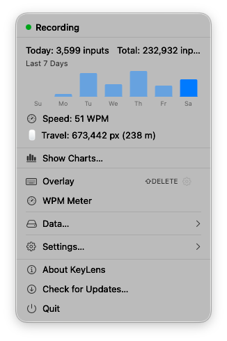

# KeyLens

[English](../README.md) | 日本語

<div align="center">


[](https://github.com/etalli/262_KeyLens/releases/latest)
[](../LICENSE)
[](https://hypercommit.com/262-keylens)

KeyLens は、キーストロークをローカルで記録し、実際の使用状況に基づいてエルゴノミックなレイアウト改善を提案する macOS メニューバーアプリです。

KeyLens が保存するのはキー名とカウントのみで、実際に入力した文字は一切記録しません。パスワードや機密情報は完全に安全です。

[**ドキュメント**](https://etalli.github.io/262_KeyLens/landing-page/) — スクリーンショットとレイアウト最適化のウォークスルー

<table>
  <tr>
    <td align="center"><br><i>メニューバー</i></td>
    <td align="center"><br><i>ヒートマップ</i></td>
  </tr>
</table>

</div>

---

## なぜ KeyLens?

キーボードのエルゴノミクスに関するアドバイスはたいてい一般論です。「Colemak を使え」「小指を使うな」「分割キーボードにしろ」。
どれも*あなた自身*の実際のタイピングパターンに基づいていません。

KeyLens はどのキーをどれだけ、どの指で押しているかを記録し、本当の負担がどこにあるかを教えてくれます。左小指が右小指の 3 倍の仕事をしているかもしれません。ある 2 キーの組み合わせが同指連打の半分を占めているかもしれません。測定できなければ改善できません。

目的は、Colemak に闇雲に移行するのではなく、実際に効果のある具体的なレイアウト変更を 1 つ行うためのデータを提供することです。キーボードショートカットは文字キーと同様に重要です。モディファイアキーやナビゲーションキーを入れ替えられなければ、レイアウトの最適化はできません。

---

## KeyLens でできること

- **タイピングの変化を追跡する** — WPM・キーストロークのリズム・疲労度を日単位・週単位で記録し、習慣が改善されているかを確認できます。
- **本当の負担箇所を特定する** — どの指が酷使されているか、どのキーペアが同指連打を引き起こしているか、両手への負荷配分をひと目で確認できます。
- **レイアウト変更を試してから決断する** — 実際のタイピングデータを使って、Colemak・Dvorak・カスタムレイアウトへ切り替えた場合の移動距離と指の負荷をシミュレーションできます。

---

## クイックインストール

1. **[KeyLens.dmg](https://github.com/etalli/262_KeyLens/releases/latest)** (またはリリースページの ZIP 版) をダウンロード
2. DMG を開き、**KeyLens.app** を `/Applications` にドラッグ
3. **重要 (セキュリティ警告の回避):** 初回起動時、macOS により「開発元を確認できないため開けません」という警告が表示されます。Terminal で以下を実行してください:

   ```bash
   sudo xattr -rd com.apple.quarantine /Applications/KeyLens.app
   ```

   その後、Finder または Spotlight から通常どおり起動してください。
4. **アクセシビリティ**権限を求めるアラートが表示されます。
   - **「システム設定を開く」** → **プライバシーとセキュリティ > Accessibility** → **KeyLens** を有効化してください。
5. 任意のアプリに戻ると、メニューバーにキーボードアイコンが表示され、モニタリングが開始されます。

---

## ドキュメント

- [HowToUse](HowToUse.ja.md) — 使い方ガイド
- [Architecture](Architecture.md) — 内部設計とセキュリティモデル
- [HowToBuild](HowToBuild.md) — ビルド・テスト・ログ
- [Roadmap](Roadmap.md) — 開発ロードマップ
- [Issues](https://github.com/etalli/262_KeyLens/issues) — バグ報告・機能要望
