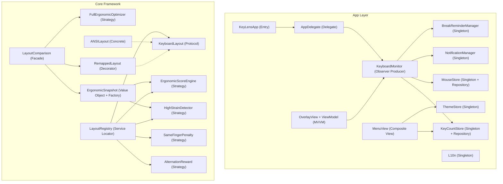

# Design Pattern Analysis — KeyLens

A comprehensive analysis of the software design patterns used in the KeyLens macOS application. Patterns are grouped by category (GoF and non-GoF), with concrete evidence citing specific files and classes.

---

## Summary

| # | Pattern | Category | Instances |
|---|---------|----------|-----------|
| 1 | Singleton | Creational | 9 |
| 2 | Factory Method | Creational | 3 |
| 3 | Prototype (Presets) | Creational | 2 |
| 4 | Observer | Behavioral | 3 mechanisms |
| 5 | Strategy | Behavioral | 6+ |
| 6 | Command | Behavioral | 1 |
| 7 | Template Method | Behavioral | 1 |
| 8 | Decorator (Wrapper) | Structural | 1 |
| 9 | Facade | Structural | 2 |
| 10 | Composite | Structural | 2 |
| 11 | Protocol Abstraction | Structural | 1 |
| 12 | MVVM | Architectural | 2 |
| 13 | Delegate | Architectural | 1 |
| 14 | Repository | Architectural | 2 |
| 15 | Service Locator / Registry | Architectural | 1 |
| 16 | Value Object | DDD | 8+ |
| 17 | Write-Behind Cache with Debounce | Data | 2 |

**Total: 17 distinct design patterns across ~50 source files.**

---

## 1. Singleton (Creational — GoF)

The most frequently used pattern. Nine classes share the `static let shared` + `private init()` idiom:

| Class | File | Purpose |
|-------|------|---------|
| `KeyCountStore` | [KeyCountStore.swift](file:///Users/k2/Library/CloudStorage/Dropbox/MyProjects/262_KeyLens/Sources/KeyLens/KeyCountStore.swift) | Global keystroke data store |
| `ThemeStore` | [ThemeStore.swift](file:///Users/k2/Library/CloudStorage/Dropbox/MyProjects/262_KeyLens/Sources/KeyLens/ThemeStore.swift) | Chart theme manager |
| `NotificationManager` | [NotificationManager.swift](file:///Users/k2/Library/CloudStorage/Dropbox/MyProjects/262_KeyLens/Sources/KeyLens/NotificationManager.swift) | macOS notification center |
| `BreakReminderManager` | [BreakReminderManager.swift](file:///Users/k2/Library/CloudStorage/Dropbox/MyProjects/262_KeyLens/Sources/KeyLens/BreakReminderManager.swift) | Typing break timer |
| `MouseStore` | [MouseStore.swift](file:///Users/k2/Library/CloudStorage/Dropbox/MyProjects/262_KeyLens/Sources/KeyLens/MouseStore.swift) | SQLite mouse movement store |
| `KeystrokeOverlayController` | [KeystrokeOverlayController.swift](file:///Users/k2/Library/CloudStorage/Dropbox/MyProjects/262_KeyLens/Sources/KeyLens/KeystrokeOverlayController.swift) | On-screen key overlay manager |
| `MenuWidgetStore` | [MenuWidgetStore.swift](file:///Users/k2/Library/CloudStorage/Dropbox/MyProjects/262_KeyLens/Sources/KeyLens/MenuWidgetStore.swift) | Menu widget ordering/toggle |
| `AIPromptStore` | [AIPromptStore.swift](file:///Users/k2/Library/CloudStorage/Dropbox/MyProjects/262_KeyLens/Sources/KeyLens/AIPromptStore.swift) | AI prompt persistence |
| `L10n` | [L10n.swift](file:///Users/k2/Library/CloudStorage/Dropbox/MyProjects/262_KeyLens/Sources/KeyLens/L10n.swift) | Localization string manager |
| `LayoutRegistry` | [KeyboardLayout.swift](file:///Users/k2/Library/CloudStorage/Dropbox/MyProjects/262_KeyLens/Sources/KeyLensCore/KeyboardLayout.swift) | Layout + engine composition |

> [!NOTE]
> `LayoutRegistry` is also a **Service Locator** — it composes `ErgonomicScoreEngine`, `HighStrainDetector`, `ThumbImbalanceDetector`, and several other analysis engines that are resolved via its properties.

---

## 2. Factory Method (Creational — GoF)

| Factory | File | What it creates |
|---------|------|-----------------|
| `LayoutRegistry.forSimulation(layout:base:)` | [KeyboardLayout.swift#L505-L524](file:///Users/k2/Library/CloudStorage/Dropbox/MyProjects/262_KeyLens/Sources/KeyLensCore/KeyboardLayout.swift#L505-L524) | Isolated `LayoutRegistry` instance for simulation, inheriting config from `base` |
| `LayoutComparison.make(bigramCounts:keyCounts:)` | [LayoutComparison.swift#L116-L171](file:///Users/k2/Library/CloudStorage/Dropbox/MyProjects/262_KeyLens/Sources/KeyLensCore/LayoutComparison.swift#L116-L171) | Orchestrates optimizer → `RemappedLayout` → two `ErgonomicSnapshot`s |
| `ErgonomicSnapshot.capture(...)` | [ErgonomicSnapshot.swift#L122-L222](file:///Users/k2/Library/CloudStorage/Dropbox/MyProjects/262_KeyLens/Sources/KeyLensCore/ErgonomicSnapshot.swift#L122-L222) | Computes all ergonomic sub-metrics into an immutable snapshot |

---

## 3. Prototype / Preset Pattern (Creational)

Pre-configured `static let` instances serve as prototypes that can be used as-is or composed into larger structures:

| Struct | Default Instance | File |
|--------|-----------------|------|
| `ErgonomicProfile` | `.standard`, `.splitErgo` | [ErgonomicProfile.swift](file:///Users/k2/Library/CloudStorage/Dropbox/MyProjects/262_KeyLens/Sources/KeyLensCore/ErgonomicProfile.swift) |
| `ErgonomicScoreWeights` | `.default` | [ErgonomicScoreEngine.swift#L96-L102](file:///Users/k2/Library/CloudStorage/Dropbox/MyProjects/262_KeyLens/Sources/KeyLensCore/ErgonomicScoreEngine.swift#L96-L102) |
| `SameFingerPenalty` | `.default` | [SameFingerPenalty.swift#L86](file:///Users/k2/Library/CloudStorage/Dropbox/MyProjects/262_KeyLens/Sources/KeyLensCore/SameFingerPenalty.swift#L86) |
| `AlternationReward` | `.default` | [AlternationReward.swift#L84-L88](file:///Users/k2/Library/CloudStorage/Dropbox/MyProjects/262_KeyLens/Sources/KeyLensCore/AlternationReward.swift#L84-L88) |
| `HighStrainDetector` | `.default` | [HighStrainDetector.swift#L58](file:///Users/k2/Library/CloudStorage/Dropbox/MyProjects/262_KeyLens/Sources/KeyLensCore/HighStrainDetector.swift#L58) |

---

## 4. Observer Pattern (Behavioral — GoF)

Three distinct observer mechanisms are used throughout the project:

### 4a. `NotificationCenter` (Classic Observer)
- `KeyboardMonitor` → posts `.keystrokeInput` → `KeystrokeOverlayController` observes
- `AppDelegate` → observes `NSApplication.didBecomeActiveNotification`
- `OverlayViewModel` → observes `.overlayConfigDidChange`
- **File:** [KeyboardMonitor.swift#L150-L152](file:///Users/k2/Library/CloudStorage/Dropbox/MyProjects/262_KeyLens/Sources/KeyLens/KeyboardMonitor.swift#L150-L152), [KeystrokeOverlayController.swift#L195-L221](file:///Users/k2/Library/CloudStorage/Dropbox/MyProjects/262_KeyLens/Sources/KeyLens/KeystrokeOverlayController.swift#L195-L221)

### 4b. Combine / `@Published` (Reactive Observer)
- `AppDelegate`, `ThemeStore`, `MenuWidgetStore` all use `@Published` properties
- SwiftUI views reactively bind via `@ObservedObject` / `@EnvironmentObject`
- **Files:** [AppDelegate.swift](file:///Users/k2/Library/CloudStorage/Dropbox/MyProjects/262_KeyLens/Sources/KeyLens/AppDelegate.swift), [ThemeStore.swift](file:///Users/k2/Library/CloudStorage/Dropbox/MyProjects/262_KeyLens/Sources/KeyLens/ThemeStore.swift)

### 4c. `objectWillChange.send()` (Manual Observer)
- `AppDelegate` manually sends change signals for non-`@Published` mutations (e.g., `toggleLaunchAtLogin()`, `changeLanguage(to:)`)
- **File:** [AppDelegate+Actions.swift](file:///Users/k2/Library/CloudStorage/Dropbox/MyProjects/262_KeyLens/Sources/KeyLens/AppDelegate+Actions.swift)

---

## 5. Strategy Pattern (Behavioral — GoF)

Each ergonomic sub-engine is a configurable value type that encapsulates a specific algorithm. These are composed into `LayoutRegistry` and can be swapped independently:

| Strategy | Configurable Parameters | File |
|----------|------------------------|------|
| `ErgonomicScoreEngine` | `weights`, `thumbEfficiencyMax` | [ErgonomicScoreEngine.swift](file:///Users/k2/Library/CloudStorage/Dropbox/MyProjects/262_KeyLens/Sources/KeyLensCore/ErgonomicScoreEngine.swift) |
| `SameFingerPenalty` | `exponent` + per-tier distance factors | [SameFingerPenalty.swift](file:///Users/k2/Library/CloudStorage/Dropbox/MyProjects/262_KeyLens/Sources/KeyLensCore/SameFingerPenalty.swift) |
| `AlternationReward` | `baseReward`, `streakThreshold`, `streakMultiplier` | [AlternationReward.swift](file:///Users/k2/Library/CloudStorage/Dropbox/MyProjects/262_KeyLens/Sources/KeyLensCore/AlternationReward.swift) |
| `HighStrainDetector` | `minimumTier` | [HighStrainDetector.swift](file:///Users/k2/Library/CloudStorage/Dropbox/MyProjects/262_KeyLens/Sources/KeyLensCore/HighStrainDetector.swift) |
| `FatigueRiskModel` | Point-based threshold logic | [FatigueRiskModel.swift](file:///Users/k2/Library/CloudStorage/Dropbox/MyProjects/262_KeyLens/Sources/KeyLensCore/FatigueRiskModel.swift) |
| `FullErgonomicOptimizer` / `SameFingerOptimizer` | `candidateLimit`, `topK`, `maxSwaps` | [FullErgonomicOptimizer.swift](file:///Users/k2/Library/CloudStorage/Dropbox/MyProjects/262_KeyLens/Sources/KeyLensCore/FullErgonomicOptimizer.swift), [SameFingerOptimizer.swift](file:///Users/k2/Library/CloudStorage/Dropbox/MyProjects/262_KeyLens/Sources/KeyLensCore/SameFingerOptimizer.swift) |

> [!TIP]
> The Strategy pattern enables the project to swap between "standard" and empirically-calibrated parameters once IKI data is collected — without modifying any consumer code.

---

## 6. Command Pattern (Behavioral — GoF)

`NSMenuItemAction` in [MenuView.swift#L442-L446](file:///Users/k2/Library/CloudStorage/Dropbox/MyProjects/262_KeyLens/Sources/KeyLens/MenuView.swift#L442-L446) encapsulates a closure as a command object. This is used to bridge SwiftUI's declarative menus to `NSMenu`'s target-action paradigm:

```swift
private final class NSMenuItemAction: NSObject {
    let block: () -> Void
    init(_ block: @escaping () -> Void) { self.block = block }
    @objc func invoke() { block() }
}
```

---

## 7. Template Method (Behavioral — GoF)

`CountData.init(from decoder:)` in [KeyCountStore.swift#L143-L186](file:///Users/k2/Library/CloudStorage/Dropbox/MyProjects/262_KeyLens/Sources/KeyLens/KeyCountStore.swift#L143-L186) overrides the standard `Codable` decode pipeline to implement a **backward-compatible migration strategy**: each field falls back to a default if missing. This is a classic Template Method — the hook points are the `try?` fallbacks for each new field.

---

## 8. Decorator / Wrapper (Structural — GoF)

`RemappedLayout` in [RemappedLayout.swift](file:///Users/k2/Library/CloudStorage/Dropbox/MyProjects/262_KeyLens/Sources/KeyLensCore/RemappedLayout.swift) wraps any `KeyboardLayout` and transparently delegates lookups through a relocation map:

```
RemappedLayout(base: ANSILayout, relocationMap: ["a":"b","b":"a"])
  ↳ finger(for: "a") → delegates to base.finger(for: "b")
```

This follows the Decorator pattern: same protocol interface (`KeyboardLayout`), with added behavior layered on top.

---

## 9. Facade (Structural — GoF)

| Facade | What it hides | File |
|--------|--------------|------|
| `LayoutComparison.make()` | Runs optimizer → builds `RemappedLayout` → creates simulation registry → captures 2 snapshots — all in one call | [LayoutComparison.swift#L116-L171](file:///Users/k2/Library/CloudStorage/Dropbox/MyProjects/262_KeyLens/Sources/KeyLensCore/LayoutComparison.swift#L116-L171) |
| `ErgonomicSnapshot.capture()` | Aggregates SFB, high-strain, alternation, thumb metrics, travel distance, typing style, and fatigue into a single snapshot | [ErgonomicSnapshot.swift#L122-L222](file:///Users/k2/Library/CloudStorage/Dropbox/MyProjects/262_KeyLens/Sources/KeyLensCore/ErgonomicSnapshot.swift#L122-L222) |

---

## 10. Composite (Structural — GoF)

SwiftUI views compose smaller views into a hierarchy:

- `MenuView` → `statusRow` / `statsSection` / `actionRow` / `settingsSection` / `footerRow`
- `SettingsMenuRow` and `DataMenuRow` are independently composable sub-menus
- **File:** [MenuView.swift](file:///Users/k2/Library/CloudStorage/Dropbox/MyProjects/262_KeyLens/Sources/KeyLens/MenuView.swift)

`ErgonomicProfile` also composes `KeyboardLayout` + `FingerLoadWeight` + `SplitKeyboardConfig` into a single configuration object — a composition of data strategies.

---

## 11. Protocol Abstraction (Structural)

`KeyboardLayout` in [KeyboardLayout.swift#L54-L74](file:///Users/k2/Library/CloudStorage/Dropbox/MyProjects/262_KeyLens/Sources/KeyLensCore/KeyboardLayout.swift#L54-L74) defines a **protocol** that abstracts physical keyboard layouts. Implementations:

| Implementation | Description |
|---------------|-------------|
| `ANSILayout` | Standard US ANSI layout with full key-code → position mapping |
| `RemappedLayout` | Decorator wrapping any `KeyboardLayout` with key relocations |

This enables the optimizer to evaluate *any* layout — real or simulated — through a uniform interface.

---

## 12. MVVM (Architectural)

| ViewModel | View | File |
|-----------|------|------|
| `OverlayViewModel` | `OverlayView` | [KeystrokeOverlayController.swift#L14-L54](file:///Users/k2/Library/CloudStorage/Dropbox/MyProjects/262_KeyLens/Sources/KeyLens/KeystrokeOverlayController.swift#L14-L54) |
| `AppDelegate` (as `ObservableObject`) | `MenuView` | [AppDelegate.swift](file:///Users/k2/Library/CloudStorage/Dropbox/MyProjects/262_KeyLens/Sources/KeyLens/AppDelegate.swift), [MenuView.swift](file:///Users/k2/Library/CloudStorage/Dropbox/MyProjects/262_KeyLens/Sources/KeyLens/MenuView.swift) |

`OverlayViewModel` is the clearest MVVM instance — it exposes `@Published` state (`keys`, `opacity`, `config`) and the view (`OverlayView`) binds reactively via `@ObservedObject`.

---

## 13. Delegate Pattern (Architectural — Cocoa)

`AppDelegate` conforms to `NSApplicationDelegate`, receiving lifecycle events:
- `applicationDidFinishLaunching(_:)` — bootstraps monitoring, hardware detection, health check
- `applicationWillTerminate(_:)` — flushes mouse data to SQLite

`KeystrokeOverlayController` conforms to `NSWindowDelegate` (tracks window drag events).

**File:** [AppDelegate.swift](file:///Users/k2/Library/CloudStorage/Dropbox/MyProjects/262_KeyLens/Sources/KeyLens/AppDelegate.swift)

---

## 14. Repository Pattern (Architectural)

| Store | Persistence | File |
|-------|-------------|------|
| `KeyCountStore` | JSON file (`counts.json`) via `Codable` | [KeyCountStore.swift](file:///Users/k2/Library/CloudStorage/Dropbox/MyProjects/262_KeyLens/Sources/KeyLens/KeyCountStore.swift) |
| `MouseStore` | SQLite via GRDB (database migrations, upserts) | [MouseStore.swift](file:///Users/k2/Library/CloudStorage/Dropbox/MyProjects/262_KeyLens/Sources/KeyLens/MouseStore.swift) |

Both abstract persistence behind a simple API (`increment()`, `addMovement()`), hiding serialization details from consumers.

---

## 15. Service Locator / Registry (Architectural)

`LayoutRegistry` in [KeyboardLayout.swift#L401-L562](file:///Users/k2/Library/CloudStorage/Dropbox/MyProjects/262_KeyLens/Sources/KeyLensCore/KeyboardLayout.swift#L401-L562) acts as a **central registry** that composes and provides access to all ergonomic engines:

```
LayoutRegistry.shared
  ├── .current: KeyboardLayout
  ├── .activeProfile: ErgonomicProfile
  ├── .sameFingerPenaltyModel: SameFingerPenalty
  ├── .alternationRewardModel: AlternationReward
  ├── .thumbImbalanceDetector: ThumbImbalanceDetector
  ├── .thumbEfficiencyCalculator: ThumbEfficiencyCalculator
  ├── .highStrainDetector: HighStrainDetector
  └── .ergonomicScoreEngine: ErgonomicScoreEngine
```

This is a **Service Locator** — downstream code resolves the appropriate engine by accessing the registry rather than constructing it directly.

---

## 16. Value Object (DDD)

Immutable structs with value semantics, used for data transfer and computation:

| Value Object | Purpose | File |
|-------------|---------|------|
| `KeyPosition` | Row/col/hand/finger for a physical key | [KeyboardLayout.swift](file:///Users/k2/Library/CloudStorage/Dropbox/MyProjects/262_KeyLens/Sources/KeyLensCore/KeyboardLayout.swift) |
| `ErgonomicSnapshot` | Immutable point-in-time ergonomic metrics | [ErgonomicSnapshot.swift](file:///Users/k2/Library/CloudStorage/Dropbox/MyProjects/262_KeyLens/Sources/KeyLensCore/ErgonomicSnapshot.swift) |
| `ErgonomicScoreWeights` | Immutable weight table for score formula | [ErgonomicScoreEngine.swift](file:///Users/k2/Library/CloudStorage/Dropbox/MyProjects/262_KeyLens/Sources/KeyLensCore/ErgonomicScoreEngine.swift) |
| `ErgonomicSwap` | Proposed key swap with projected improvement | [FullErgonomicOptimizer.swift](file:///Users/k2/Library/CloudStorage/Dropbox/MyProjects/262_KeyLens/Sources/KeyLensCore/FullErgonomicOptimizer.swift) |
| `KeySwap` | Proposed SFB-optimized swap | [SameFingerOptimizer.swift](file:///Users/k2/Library/CloudStorage/Dropbox/MyProjects/262_KeyLens/Sources/KeyLensCore/SameFingerOptimizer.swift) |
| `LayoutComparison` | Before/after snapshot pair with deltas | [LayoutComparison.swift](file:///Users/k2/Library/CloudStorage/Dropbox/MyProjects/262_KeyLens/Sources/KeyLensCore/LayoutComparison.swift) |
| `CountData` | Codable aggregate of all persisted metrics | [KeyCountStore.swift](file:///Users/k2/Library/CloudStorage/Dropbox/MyProjects/262_KeyLens/Sources/KeyLens/KeyCountStore.swift) |
| `KeystrokeEvent`, `OverlayEntry` | UI event data carriers | [KeyboardMonitor.swift](file:///Users/k2/Library/CloudStorage/Dropbox/MyProjects/262_KeyLens/Sources/KeyLens/KeyboardMonitor.swift), [KeystrokeOverlayController.swift](file:///Users/k2/Library/CloudStorage/Dropbox/MyProjects/262_KeyLens/Sources/KeyLens/KeystrokeOverlayController.swift) |

---

## 17. Write-Behind Cache with Debounce (Data Pattern)

Two stores use in-memory accumulation with deferred disk writes:

| Store | Mechanism | File |
|-------|-----------|------|
| `KeyCountStore` | `scheduleSave()` debounces writes to JSON — 2-second delay after last mutation | [KeyCountStore.swift#L500-L505](file:///Users/k2/Library/CloudStorage/Dropbox/MyProjects/262_KeyLens/Sources/KeyLens/KeyCountStore.swift#L500-L505) |
| `MouseStore` | 30-second periodic `DispatchSourceTimer` flushes accumulated mouse distance to SQLite | [MouseStore.swift#L99-L105](file:///Users/k2/Library/CloudStorage/Dropbox/MyProjects/262_KeyLens/Sources/KeyLens/MouseStore.swift#L99-L105) |

Both use `flushSync()` or synchronous save on app termination to prevent data loss.

---

## Architecture Diagram



---

## Key Observations

1. **Clean layering:** `KeyLensCore` (21 files) has zero dependencies on AppKit/SwiftUI — it is a pure Swift framework. `KeyLens` (30 files) handles all UI and macOS integration.

2. **Singleton prevalence:** 9 singletons are appropriate here — they represent global shared resources (data stores, managers, registries) in a single-window menu bar app.

3. **Strategy-heavy core engine:** The ergonomic analysis framework is designed for extensibility — every scoring sub-component is a configurable value type with a `.default` preset. This enables A/B testing of different scoring parameters without touching consumer code.

4. **Dual persistence strategies:** JSON-file for keystroke data (`Codable` with migration), SQLite for mouse data (GRDB with schema migrations) — each chosen to match the data's access patterns.

5. **Value-type dominance in Core:** Nearly all `KeyLensCore` types are `struct`s with `Equatable` conformance, enabling predictable composition and testability across 17 test files.
